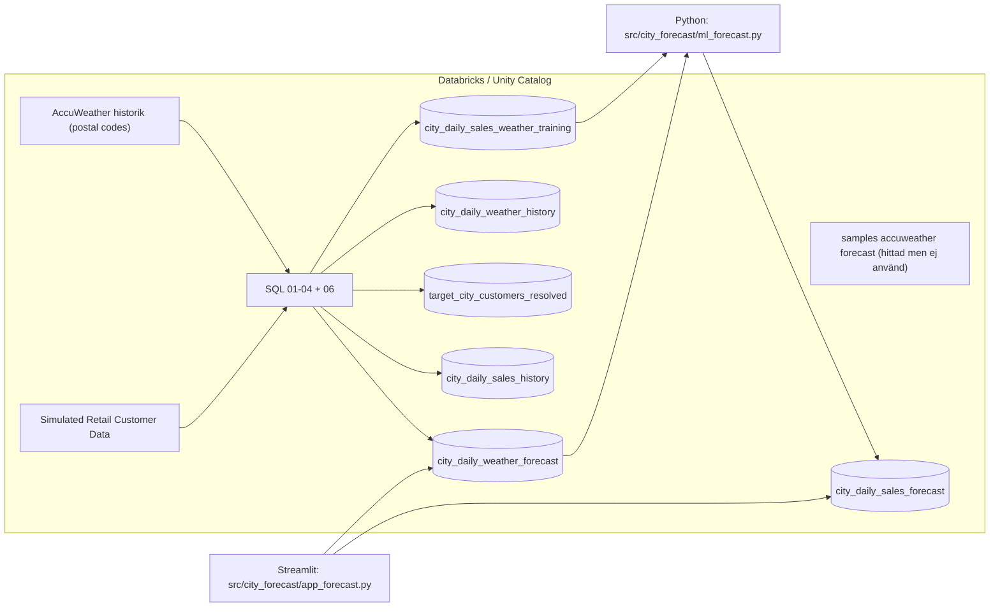

# Väder möter försäljning (stadnivå, 10 dagar)

Det här projektet kombinerar väder (AccuWeather) och syntetisk retail-data (Simulated Retail Customer Data) i Databricks för att skapa en stadnivå-prognos av försäljning för de kommande 10 dagarna och visa resultatet i en enkel Streamlit-app.

## Målbild

För exakt dessa fem städer:

- Los Angeles, CA
- Chicago, IL
- Columbus, OH
- Jacksonville, FL
- Portland, OR

Skapar vi:

- `city_daily_weather_forecast`: 10 dagars väder (1 rad per `city,state,date`)
- `city_daily_sales_forecast`: 10 dagars försäljningsprognos (1 rad per `city,state,date`)
- En Streamlit-app som låter dig välja stad och (valfritt) plotta en vädervariabel på en sekundär Y-axel.

## Lösning (arkitektur)



### Viktig notis om forecast-väder

Vi hittade en forecast-tabell i `samples.accuweather.forecast_daily_calendar_metric`, men:

- den saknade 4/5 av våra städer, och
- den var daterad (observerade datum i juli 2024).

Därför genereras `city_daily_weather_forecast` som en deterministisk proxy-prognos från historisk postal-code-daily data (se `src/city_forecast/docs/forecast_weather_source_notes.md`).

## Skapade tabeller (UC)

Alla tabeller skapas i schemat:

- `fp_hack.alexander_groth_hackathon`

Nyckeltabeller:

- `fp_hack.alexander_groth_hackathon.city_daily_weather_forecast`
- `fp_hack.alexander_groth_hackathon.city_daily_sales_forecast`

Mer schema/datakvalitet finns i:

- `src/city_forecast/docs/schema_documentation.md`

## Köra projektet

### 1) Installera dependencies

```bash
UV_CACHE_DIR=/tmp/uv-cache uv sync
```

### 2) (Om du vill) kör SQL-skripten i Databricks

SQL-filerna finns i `src/city_forecast/sql/` och körs i ordning:

- `01_city_daily_weather_forecast.sql`
- `02_city_daily_weather_history.sql`
- `03_target_city_customers_resolved.sql`
- `04_city_daily_sales_history.sql`
- `06_city_daily_sales_weather_training.sql`

### 3) Träna modell och skriv prognostabell

Använd SQL Warehouse-id (exempel): `cfe55031a9b649cb`

```bash
DATABRICKS_WAREHOUSE_ID=cfe55031a9b649cb UV_CACHE_DIR=/tmp/uv-cache uv run python -m src.city_forecast.ml_forecast --write-databricks
```

### 4) Starta Streamlit-appen

```bash
DATABRICKS_WAREHOUSE_ID=cfe55031a9b649cb UV_CACHE_DIR=/tmp/uv-cache uv run streamlit run src/city_forecast/app_forecast.py
```

## Så använder du appen

- Välj stad i dropdownen.
- Tabellvyn visar 10 dagar med `sales_amount_pred` och vädernycklar.
- Grafen visar alltid Predicted sales (blå, vänster Y-axel).
- Välj Secondary line (weather attribute) för att lägga till en väderkurva (orange, höger Y-axel). Standard är `None`.

## Kända begränsningar

- Träningsmängden är liten (en kort historisk period), vilket gör modellen instabil och metrik svårtolkad.
- Forecast-väder är proxy (day-of-week-medel per representativt postnummer), inte en riktig prognosfeed.
